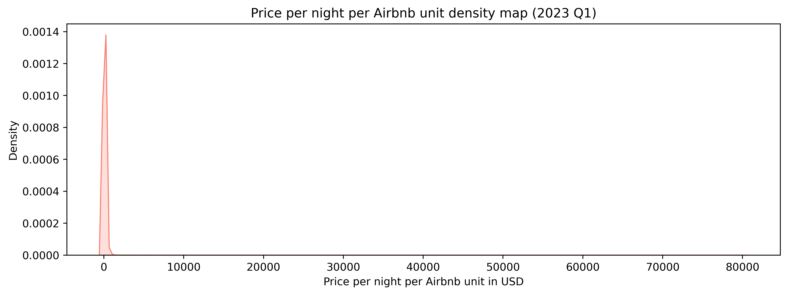
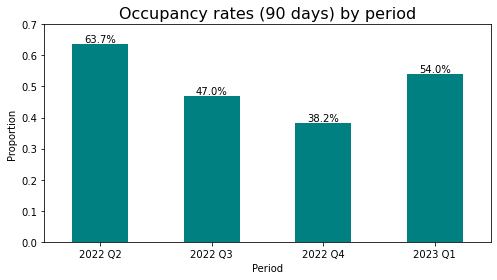

# Airbnb Data Analysis - Porto 2023 

Table of Contents:
1. Requirements
2. File Descriptions
3. Data
4. Project Motivation
5. Summary of the Analysis
6. Acknowledgements
7. Author

---
## 1. Requirements
To be able to run the code on your own you will need the following software:
- Python v.3.8.+
- Jupyter Notebook
- Suggestion: Anaconda v.4.+ since it has both in one suite.

To run the code, you will also need to open unpack the zip file _../model/calendar.csv.gz_ in the same directory. 
  
## 2. File Descriptions
- airbnb-porto-2023-eda.ipynb: Jupyter Notebook, which contains the full code.
- 202206-listings.csv: Snapshot of Airbnb listing's data from Q2 2022
- 202209-listings.csv: Snapshot of Airbnb listing's data from Q3 2022
- 202212-listings.csv: Snapshot of Airbnb listing's data from Q4 2022
- 202303-listings.csv: Snapshot of Airbnb listing's data from Q1 2023
- 202303-calendar.csv (obtained from zip): Snapshot of Airbnb activity's data from Q1 2022

## 3. Data
The data was obtained from the website <a href=http://insideairbnb.com/get-the-data/>Inside Airbnb</a> and is made of 4 CSV files which contains listing information and 1 CSV file with activity information. The listing files are the focus of the project while the calendar.csv was used just for a quality check.

The listing's data contains among others these columns:
- id
- name
- description
- host_is_superhost
- neighbourhood
- property_type
- bedrooms
- beds
- bathrooms
- amenities
- price
- availabity_90
- number_of_reviews
- review_scores_rating
- etc.

The data dictionary of the columns can be found [here](https://docs.google.com/spreadsheets/d/1iWCNJcSutYqpULSQHlNyGInUvHg2BoUGoNRIGa6Szc4/edit#gid=1322284596).

### Limitations of the data
Although there is relevant information available about the listings, there are still some features missing which may influence the analysis, especially when trying to predict the price, the occupancy or explaining causality for something we see in the data. The list is not exhaustive but gives an overview of these limitations:
- This data is composed of snapshots quarterly, which means that numbers like availability rates can change over time.
- Information about state (brand new/old) of the listing is not available.
- Size of the listing is not available.
- Other subjective factors cannot be measured like decoration, natural light, overall attractiveness, etc.
- Only the last 12 months of data were available.

## 4. Project Motivation
This project was done as part of the curriculum of the [Udacity's Data Scientist Nanodegree](https://www.udacity.com/course/data-scientist-nanodegree--nd025). I decided to choose this project because of my personal motivations. I am natural from Porto, Portugal and also, I am interested in Airbnb market of that region. Since roughly 2015 the country has seen a dramatic increase in tourists and house prices. Then, in 2019 the COVID pandemic also hit the region hard and since 2022 things seem to be recovering. For these reasons I liked the context of the analysis.

The __main goals__ of this project were to investigate:
1. How the number of listings, prices and overnights were evolving after the pandemic.
2. How the occupancy rate is generally distributed - for example whether superhosts in general have higher occupancy rates.
3. Whether it was possible to create a predictive model for the price per night based on the available data. 

## 5. Summary of the Analysis
As with many data analysis projects start, the first thing I wanted to see is how the data looks like: which portion of the data is missing, which columns hold important information and which not, and also look at the distribution of the continuous variables. In this case, I was particular interested to see how the __price distribution__ looked like, since I was using it later as my target variable for the model and this was the image I got:

As one can see the distribution is so skewed to the right that the curve of the distribution is almost a straight line in the graphic. This is due to the fact that there are few, but very extreme values in this dataset - the so-called outliers. The highest price per night one could pay in Porto based on Q1 2023's data was $80100. I knew directly I needed to address this later and I also decided to use the median instead of the mean for the analyses as it is less sensitive to outliers.

You may find more analyses like this in the [Jupyter notebook](https://github.com/bruno-f7s/portfolio/blob/main/airbnb-porto-2023/airbnb-porto-2023-eda.ipynb). Below, you can find a summary of the relevant findings related to the initial business questions.

### Evolution of the number of listings, prices and occupancy rates
The data I gathered goes from Q2 2022 until Q1 2023. This means 12 months of historical data that coincide with the "end" of the pandemic, when people could start to travel again with less restrictions. Looking at the number of Airbnb listings available for this time period, we can see that the hosts were also probably expecting and increase in tourists:

Of course, we do not know the causes or if this trend was already there before, but looking at the data at hand we can see some optimism in the market. This is not valid for all cities of the Porto metropolitan area: some cities actually had a decrease in the number of offerings (more info in the Jupyter notebook).

Regarding the __occupancy rates__ the picture is a bit different:

Looking at the graphic we see a decrease of the occupancy rates in the colder months, which is somewhat expected since the majority of the listings is probably dependent on tourism, which in this phase of the year generally decreases in the northern hemisphere. To actually evaluate if these numbers are high or not, more historical data would have been needed. Neverthless, we can have an estimate based on statistic reports. 

## 6. Acknowledgements
- I would like to point out that the website <a href=http://insideairbnb.com/get-the-data/>Inside Airbnb</a> does an amazing job in keeping data up-to-date and for numerous cities worldwide.
- I would like to mention that both this courses curriculum and some posts from [Robert Chang](https://medium.com/@rchang) served as inspiration for this project.

## 7.Author
Bruno Fernandes - Data Analyst & Enthusiast - [LinkedIn](https://www.linkedin.com/in/b-fernandes/) - [Xing](xing.to/brunofernandes)
