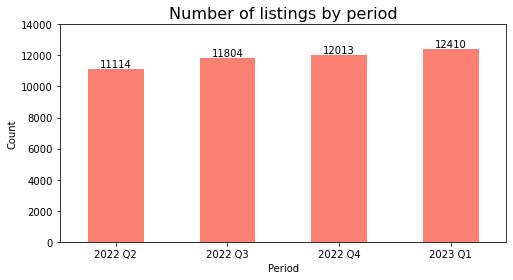

# Airbnb Data Analysis - Porto 2023 

Table of Contents:
1. Requirements
2. File Descriptions
3. Data
4. Project Motivation
5. Summary of the Analysis
6. Acknowledgements
7. Author

---
## 1. Requirements
To run the code you need the following software:
- Python v.3+
- Jupyter Notebook
- Suggestion: Anaconda v.4+ since it has both in one suite.

Additionally, you need to unpack the zip file _../model/calendar.csv.gz_ in the same directory. 
  
## 2. File Descriptions
- _airbnb-porto-2023-eda.ipynb_: Jupyter Notebook, which contains the full code.
- _202206-listings.csv_: Snapshot of Airbnb listing's data from Q2 2022
- _202209-listings.csv_: Snapshot of Airbnb listing's data from Q3 2022
- _202212-listings.csv_: Snapshot of Airbnb listing's data from Q4 2022
- _202303-listings.csv_: Snapshot of Airbnb listing's data from Q1 2023
- _202303-calendar.csv_: Snapshot of Airbnb activity's data from Q1 2022 (obtained from the zip file: _calendar.csv.gz_)

## 3. Data
The data was obtained from the website <a href=http://insideairbnb.com/get-the-data/>Inside Airbnb</a> and it is made of 4 CSV files - which contains listing information - and 1 CSV file with activity information. The listing files are the focus of the project while the calendar.csv was used just for a quality check.

The listing's data contains, among others, these columns:
- id
- name
- description
- host_is_superhost
- neighbourhood
- property_type
- bedrooms
- beds
- bathrooms
- amenities
- price
- availabity_90
- number_of_reviews
- review_scores_rating
- etc.

The data dictionary of the columns can be found [here](https://docs.google.com/spreadsheets/d/1iWCNJcSutYqpULSQHlNyGInUvHg2BoUGoNRIGa6Szc4/edit#gid=1322284596).

### Limitations of the data
Although there is relevant information available about the listings, there are still some features missing which may influence the analysis, especially when trying to predict the price, the occupancy or explaining causality for something interesting we may see in the data. This list is not exhaustive but gives an overview of these limitations:
- This data is composed of quarterly snapshots, which means that numbers like availability rates can change over time.
- Information about state of the listing (brand new/used) is not available.
- Size of the listing is not available.
- Other subjective factors cannot be measured like decoration, natural light, overall attractiveness, etc.
- Only the last 12 months of data were available.

## 4. Project Motivation
This project was done as part of the curriculum of the [Udacity's Data Scientist Nanodegree](https://www.udacity.com/course/data-scientist-nanodegree--nd025). I decided to choose this analyis due to various reasons:
- I am natural from Porto, Portugal and I am interested in Airbnb market of that region.
- Since roughly 2015 the country has seen a dramatic increase in tourists and house prices. Then, in 2019 the COVID pandemic also hit the region hard and since 2022 things seem to be recovering.

The __main goals__ of this project were to investigate:
1. How the number of listings, prices and overnights was evolving after the pandemic.
2. How the occupancy rate was generally distributed - for example whether superhosts in general had higher occupancy rates.
3. Whether it was possible to create a predictive model for the price per night based on the available data. 

## 5. Summary of the Analysis
Like many data analysis projects start, the first thing I wanted to see is how the data looks like: which portion of the data is missing, which columns hold important information or to look at the distribution of the continuous variables. In this case, I was interested to see how the __price distribution__ looked like, since I was using it later as my target variable for the model.

As one can see the distribution is so skewed to the right that the curve of the distribution is almost a straight line in the graphic. This is due to the fact that there are few, but very extreme values in this dataset - the so-called outliers. The highest price per night one could pay in Porto based on Q1 2023's data was $80100. I knew directly I needed to address this later and I also decided to use the median instead of the mean for the further analyses, as it is less sensitive to outliers.

You may find more analyses like this in the [Jupyter notebook](https://github.com/bruno-f7s/portfolio/blob/main/airbnb-porto-2023/airbnb-porto-2023-eda.ipynb). Below, you can find a summary of the relevant findings related to the initial business questions.

### Evolution of the number of listings, prices and occupancy rates
The data I gathered goes from Q2 2022 until Q1 2023. This means 12 months of historical data that coincide with the "end" of the pandemic, when people could start to travel again with less restrictions. Looking at the number of Airbnb listings available for this time period, we can see that the hosts were also probably expecting an increase in tourists:

Of course, we do not know the causes for this or if the trend was already there before, but looking at the data at hand we can see some optimism in the market. This is not valid for all cities of the Porto metropolitan area: some cities had a decrease in the number of offerings (more info in the Jupyter notebook).

Regarding the __occupancy rates__ the picture is a bit different:

Looking at the graphic we see a decrease of the occupancy rates in the colder months, which is somewhat expected since most of the listings are likely dependent on tourism, which in this phase of the year generally decreases in the northern hemisphere. To evaluate if these numbers are high or not, more historical data would have been needed. Nevertheless, we can have an estimate based on statistic reports. The official  Portuguese tourism agency reports that the average occupancy rates for this region in 2018 was around 73% (for hotels), so this could be used as a rough estimate [source](https://travelbi.turismodeportugal.pt/alojamento/taxas-de-ocupacao-quartocama/). In the data I gathered, the mean value was 51%, which means that this value is still far behind the pre-pandemic numbers. 

This distribution of the occupancy rates by period looks very similar across the different cities of the region:

As for the median __prices per night__, we also see a different picture:

In this case the median price per night decreased in the second half of the data. It is difficult to explain this with the data and one reason could be because of the skewness of the price distribution, but I decided not to focus too much on this explanation. Instead, I investigated how the price was distributed by other features, since this feature would be my target feature for the ml model and here is an example for the median price per Airbnb listing:

Here we can clearly see that has the number of bedrooms per listing increases, so does the median price. The drops at 10 and 14 bedrooms really caught my eye and I decided to analyze it further. It turned out that in these categories there were only a few listings and they referred to hostels not or other shared accommodations, not an entire housing unit.

Another aspect I investigated was the number of reviews vs the median price (until $500), in this case just for the last quarter: 

The scatterplot above shows that there is not any strong correlation between the two features.

### Distributions of the occupancy rate
I decided to put some focus in the occupancy rate because it is what it most matters when someone has a room to rent, so I wanted to interesting findings this data could delivered. Intuitively we humans tend to follow what others do and when buying something from the internet we like to look at the review scores and number of reviews. I wanted to see if the with increased number of reviews the occupancy rates also increase:

The graphic clearly shows a positive trend. Of course, one thing can lead to another, but this can still be a good assumption because (1) not every guest leaves a review and (2) the listings with higher reviews have been visited before. This occupancy rate we are looking at is for the next 90 days.

Another thing I thought it would be interesting would be if superhosts (which typically are a good reference for a guest) actually had higher occupancy rates than the normal hosts.

The table above shows some interesting information: In the colder months were the occupancy rate in general is lower, the normal hosts had a higher occupancy rate and in the high season the superhosts actually had a higher occupancy rate. It seems that has the occupancy rate increases so it increases the difference between the two types of hosts. This of course cannot be a certainty using only this amount of data, but it is interesting, nonetheless.

Then I looked at the whole distribution of the listings by the occupancy rate for these two categories of hosts:

Looking at the superhosts (in orange) we see that the number of listings they have is almost uniformly distributed for all occupancy rates. So we can assume that we have has many superhosts which have a 20% occupancy rate as we have with 80%. The picture changes for the non-superhosts (in blue): we can see that the majority of the non-superhosts listings have lower occupancy rates, but we also see a big amount of them concentrated at around 100%. This is particularly interesting because there are some non-superhosts which are practically sold-out all the time. 

### Predicting the price per night of an Airbnb Unit
To train the model I needed to make some feature selection and transformation. In summary, I used all relevant information about a listing like number of bedrooms, beds, bathrooms, how many guests it could accommodate, its location and some types of amenities it offered. I left out some features like the type of host, number of reviews, occupancy rates for various reasons. For example, the 90-day occupancy rate or number or reviews do not have any strong correlation with the price and if the listing is new these values will always be 0.

I only used the last period (Q1 2023) of data because for this purpose I am not interested on the evolution of the prices in this period of time but rather focus on the current situation. As we saw with the pandemic, external events can have a lot of influence.

Finally, I also decided to only use listings for training that had a maximum price per night of $500 and removed the outliers (0.7% of the total). Although this may be important information, we might have not been able to explain these extreme prizes with the data at hand. For example, an important factor missing is the size of the listing. Also, my goal was to predict a listing that is somehow realistic in a normal context. I personally think that after a certain threshold of luxury you are free to dictate the price.

Based on these assumptions I trained the model an achieved a root mean squared error of about $41, which is not great in this context. This means that our prediction could have a deviation of +- $41 and still be considered "normal" when comparing to the rest. If we are looking at a $400 unit then this might not be a problem, but for smaller numbers this can make a big difference. However, looking at the median price distribution and the limitation in our dataset this is actually not that bad.

I then used a listing for prediction with some features based on an actual listing I known, and the prediction was $63. Knowing I well some of the features are and my personal taste I would use the error to inflate the price a little. Probably not to the maximum but maybe on the middle and put the listing for rent at around $85.

## 6. Acknowledgements
- I would like to point out that the website <a href=http://insideairbnb.com/get-the-data/>Inside Airbnb</a> does an amazing job in keeping data up-to-date and for numerous cities worldwide.
- I would like to mention that both this courses curriculum and some posts from [Robert Chang](https://medium.com/@rchang) served as inspiration for this project.

## 7. Author
Bruno Fernandes - Data Analyst & Enthusiast - [LinkedIn](https://www.linkedin.com/in/b-fernandes/) - [Xing](xing.to/brunofernandes)
