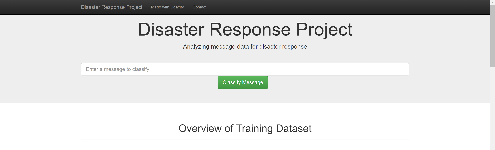
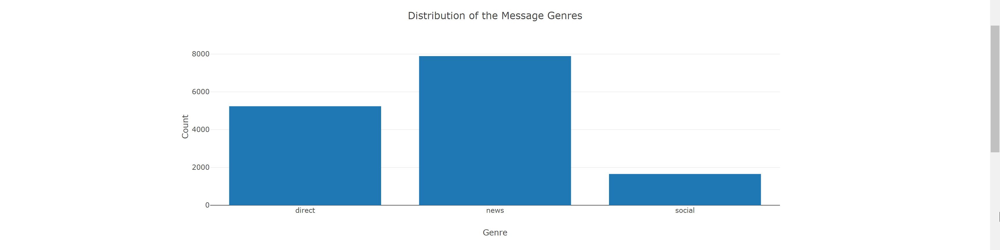
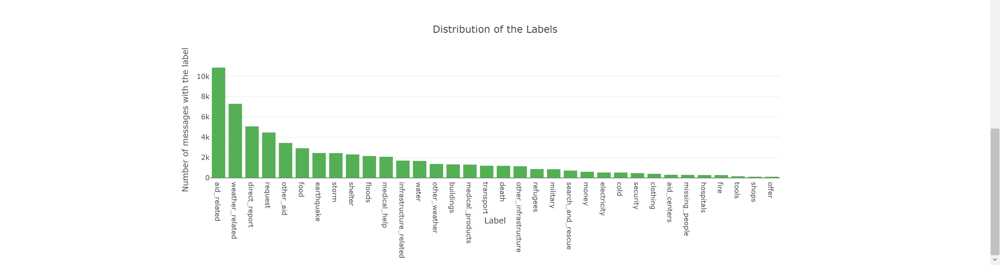

# Disaster Response Classification
Table of Contents:
1. Project introduction
2. Requirements
3. How to run the code
4. File descriptions
5. Data
6. Web app
7. Disclaimer

---
## 1. Project introduction
This project was developed as part of the [Udacity's Data Scientist Nanodegree program]( https://www.udacity.com/course/data-scientist-nanodegree--nd025) and consists of a machine learning multi-label classification problem. The objective was to train a model that can predict the labels for text messages and deploy it onto a simple web app so other users can interact with the model. 

For better understanding of the context of the problem here is an example: let us assume that a certain natural disaster occurs in a certain region and that people affected in that region start to post messages online in a specific social media platform. These messages could then be classified live using the model, which could more quickly be intercepted by a specific helper organization to indentify which kind of help would be needed or what kind of disaster had happened. Possible classification categories can be _food_, _water_, _earthquake_, etc.

The goal of the project was not to create the best possible model but instead develop and apply the needed skills to create a data preparation pipeline, a machine learning pipeline as well as a web interface.


## 2. Requirements
To run the code you need the following software:
- Python v.3+
- Packages:
  - pandas
  - numpy
  - sklearn
  - re
  - nltk
  - sqlite3
  - joblib 
- Suggestion: Anaconda v.4+ since it already includes the majority of the needed packages


## 3. How to run the code
To interact with this code follow these steps (for Windows OS):
1. Download the complete project or fork this repository to your local computer.
2. (Not necessary if the `data\DisasterResponse.db` is already available). To run the ETL pipeline that cleans, processes and stores the data, change the directory to `data` and run this command: `python process_data.py messages.csv categories.csv DisasterResponse.db`
3. (Not necessary if the `model\dr_classifier.pkl` is already available). To run the ML pipeline that trains and deploys the model, change the directory to `models` and run this command: `python train_classifier.py ..\data\DisasterResponse.db dr_classifier.pkl` for MAC OS: `python train_classifier.py ../data/DisasterResponse.db dr_classifier.pkl`.
4. To start the app run the following command inside the `app` directory: `python run.py`.
5. Open this link on your browser: [http://127.0.0.1:3001/](http://127.0.0.1:3001/).


## 4. File Descriptions
### 4.1. Web App
| File Name      | Description |
| ----------- | ----------- |
| go.html      | HTML file that takes care of the URL parameters for the messages (provided by Udacity).  |
| master.html    | HTML file with the full HTML structure of the web app (provided by Udacity). |
| run.py    | Script used to fire up the web app and take care of the back-end. |


### 4.2. Data
| File Name      | Description |
| ----------- | ----------- |
| categories.csv      | CSV file with the categories' data provided by [Appen](https://appen.com/). |
| messages.csv      | CSV file with the messages' data provided by [Appen](https://appen.com/). |
| process_data.py    | Script used to load and process the data from the CSV files and create a SQL Lite database. |
| DisasterResponse.db   | SQL Lite database containing the processed and labelled data. |


### 4.3. Model
| File Name      | Description |
| ----------- | ----------- |
| train_classifier.py      | Script with a ML pipeline to create the best fitting model based on an algorithm and multiple parameters. It deploys the model as a pickel file.|
| dr_classifier.pkl      | Pickel file with the fitted model. |


### 4.4. Extra
| File Name      | Description |
| ----------- | ----------- |
| data-preparation.ipynb      | Jupyter notebook with the loading and preparation steps. The file was used as an assistance to try and run the code of process_data.py and it is NOT NEEDED to run the web app.|
| ml-pipeline-preparation.ipynb     | Jupyter notebook with the ml-pipeline. The file was used as an assistance to try out different options and to choose the best algorithm for the ml-pipeline of train_classifier.py. It is NOT NEEDED to run the web app. |


## 5. Data
The data consists of labelled messages and was provided by [Appen](https://appen.com/). It is divided into two csv files: categories.csv and messages.csv.

### 5.1. File: messages.csv
The messages.csv file has 4 columns:
- __id__: the message's id.
- __message__: the text information of the message in English. Example: "Is the Hurricane over or is it not over".
- __original__:  the text information of the message in its original language. Example: "Cyclone nan fini osinon li pa fini".
- __genre__: a category with the type of genre of the message (direct, news, social)

### 5.2. File: categories.csv
The messages.csv file has 2 columns:
- __id__: the message's id.
- __categories__: a string column with all the labels and their values (1 or 0) for the current message, example: "related-1;request-0;offer-0;aid_related-0;...".

### 5.3. Data Limitations
- The dataset has 26216 rows and 36 labels. Although the number of rows is of a considerable size there are many different labels.
- The labels _related_ and _child_alone_ only include one of the categories (1 or 0) and therefore do not hold any prediction power.
- Many labels like _aid_centers_ (2.1%), _tools_ (1.1%), _ shops_ (0.8%), etc. are extremely imbalanced. This will be a challenge for the algorithms considering the amount of data available and the complexity of the classification problem. 
- Without the two labels _ related_ and _ child_alone_, 11431 messages (57% of total) do not have any other label present. This means that these rows will always miss a predictive label. This data was excluded from the training process to try compensating for the imbalanced labels and try some overfitting on said labels.

## 6 Web app
The web app has an area where the use can enter a message for classification:



Below that area there are two graphics that give an overview about the data at hand.





The performance of the model for the __training set__ can be seen below:

__Accuracy__ per label:
```
related                   0.798347
request                   0.871710
offer                     0.989320
aid_related               0.764654
medical_help              0.895613
medical_products          0.932740
search_and_rescue         0.947616
security                  0.961983
military                  0.964781
water                     0.957915
food                      0.944056
shelter                   0.931977
clothing                  0.985633
money                     0.966434
missing_people            0.974698
refugees                  0.949523
death                     0.958805
other_aid                 0.795296
infrastructure_related    0.880229
transport                 0.920407
buildings                 0.945327
electricity               0.974444
tools                     0.986777
hospitals                 0.977877
shops                     0.990973
aid_centers               0.975334
other_infrastructure      0.912524
weather_related           0.868404
floods                    0.933249
storm                     0.939733
fire                      0.986523
earthquake                0.964526
cold                      0.977877
other_weather             0.909727
direct_report             0.821360
```

__Precision__, __Recall__ and __F1-Score__ per label:
```
                        precision    recall  f1-score   support

               related       0.90      0.83      0.86      5992
               request       0.60      0.73      0.66      1332
                 offer       0.04      0.06      0.05        36
           aid_related       0.71      0.71      0.71      3219
          medical_help       0.39      0.52      0.45       638
      medical_products       0.39      0.46      0.42       418
     search_and_rescue       0.16      0.28      0.20       192
              security       0.09      0.12      0.11       144
              military       0.44      0.49      0.46       245
                 water       0.64      0.76      0.70       500
                  food       0.72      0.81      0.76       878
               shelter       0.60      0.73      0.66       705
              clothing       0.51      0.57      0.54       115
                 money       0.32      0.51      0.39       170
        missing_people       0.18      0.34      0.24        92
              refugees       0.32      0.46      0.38       260
                 death       0.55      0.67      0.60       366
             other_aid       0.31      0.46      0.37      1033
infrastructure_related       0.21      0.32      0.26       505
             transport       0.25      0.36      0.29       362
             buildings       0.46      0.60      0.52       392
           electricity       0.41      0.45      0.43       168
                 tools       0.06      0.08      0.07        48
             hospitals       0.15      0.26      0.19        78
                 shops       0.04      0.07      0.05        28
           aid_centers       0.14      0.17      0.15       103
  other_infrastructure       0.18      0.28      0.21       341
       weather_related       0.76      0.77      0.76      2163
                floods       0.57      0.65      0.61       623
                 storm       0.66      0.75      0.70       738
                  fire       0.36      0.35      0.35        83
            earthquake       0.79      0.82      0.80       702
                  cold       0.49      0.56      0.52       171
         other_weather       0.24      0.34      0.28       415
         direct_report       0.54      0.65      0.59      1544

             micro avg       0.60      0.68      0.64     24799
             macro avg       0.41      0.48      0.44     24799
          weighted avg       0.64      0.68      0.65     24799
           samples avg       0.67      0.76      0.58     24799
```

__Observation__: We can see that the overall accuracy is high but when we look at the other metrics, we see that precision and recall are not very good for the most imbalanced categories. This was somewhat expected and therefore the model was tuned for the best f1-score possible to try balancing out the metrics.


## 7 Disclaimer
- The data was provided by [Appen](https://appen.com/).
- The HTML code parts were provided by [Udacity](https://www.udacity.com).
